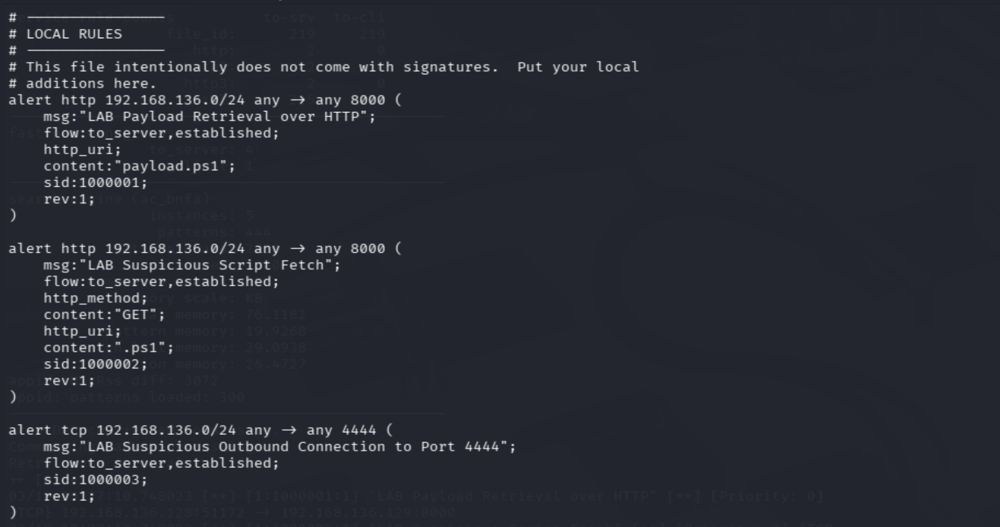
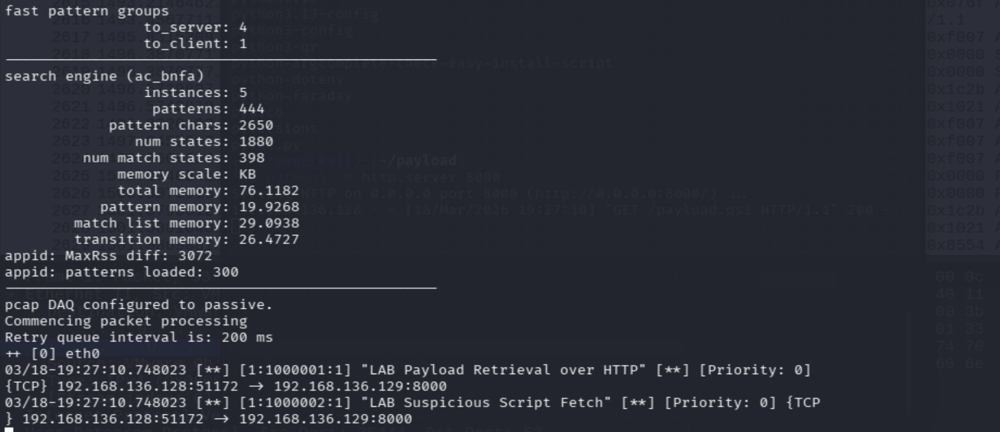

# Detection — PowerShell Attack Chain

## Objective

Detect a simple PowerShell-based attack that includes script execution, network activity, and persistence.

---

## Detection Logic

This detection focuses on finding suspicious PowerShell behavior.

Main things to look for:

- PowerShell execution  
- Use of DownloadString  
- Network connection to attacker  
- Registry persistence  

---

## Splunk Detection

### 1. PowerShell Execution
```spl
    source="XmlWinEventLog:Microsoft-Windows-Sysmon/Operational" EventID=1 Image="*powershell.exe"
    CommandLine="*DownloadString*"
    | table _time Image ParentImage CommandLine User
    | sort - _time
```


This shows PowerShell running a command that downloads and executes a script.

---

### 2. Network Activity
```spl
    source="XmlWinEventLog:Microsoft-Windows-Sysmon/Operational" EventID=3 DestinationIp="192.168.136.129"
    | table _time Image DestinationIp DestinationPort Protocol User
    | sort - _time
```


This shows the victim machine connecting to the attacker machine.

---

### 3. Persistence Detection
```spl
    source="XmlWinEventLog:Microsoft-Windows-Sysmon/Operational" EventID=13 TargetObject="*Updater*"
    | table _time Image TargetObject Details User
    | sort - _time
```


This shows a registry key being created for persistence.

---

## Snort Detection

### Snort Rules
```snort
    alert tcp any any -> 192.168.136.129 8000 (msg:"Possible Payload Download"; sid:1000001; rev:1;)
    alert tcp any any -> 192.168.136.129 8000 (msg:"Suspicious HTTP Traffic"; sid:1000002; rev:1;)
```


These rules detect traffic going to the attacker machine.

---

### Snort Alert Evidence



Snort generated alerts when the attack happened.

---

## Explanation

The detection uses both endpoint logs and network monitoring.

PowerShell with DownloadString is suspicious because it can run scripts from the internet.

The network connection shows communication with the attacker.

The registry change shows that the attacker tried to stay in the system.

---

## Why It Matters

This kind of behavior is common in real attacks.

If we detect it early, we can stop the attack before it becomes more serious.

---

## False Positives

- Normal admin scripts  
- IT automation  
- Internal tools  

These need to be checked based on context.
