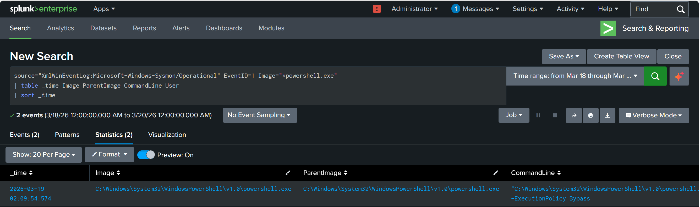
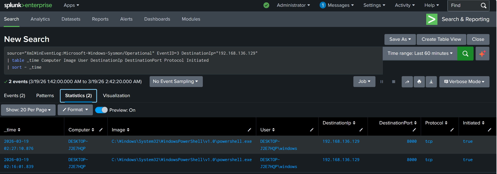
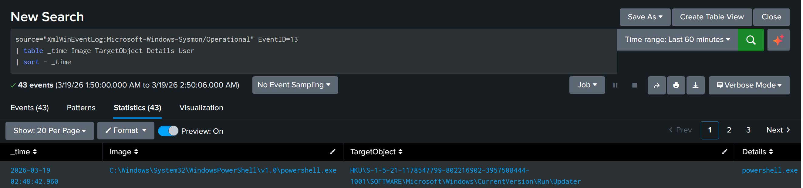

# Scenario 1 — Investigation Analysis

## Overview

This analysis reconstructs a PowerShell-based attack using endpoint and network telemetry. The goal is to understand how each stage of the attack can be detected and correlated.

---

## Timeline

The following timeline shows the sequence of events observed during the attack:

- 02:09:54 — PowerShell execution detected (Event ID 1)  
- 02:16:01 — Outbound HTTP connection to attacker machine (Event ID 3)  
- 02:27:10 — Continued communication with attacker system  
- 02:48:42 — Registry persistence created (Event ID 13)  

### Supporting Evidence — Execution

The image shows PowerShell executed with the ExecutionPolicy Bypass flag, which is commonly associated with suspicious activity.

### Supporting Evidence — Network Activity

The image shows an outbound connection from PowerShell to the attacker machine over HTTP.

---

### Supporting Evidence — Persistence

The registry modification confirms persistence via a Run key.

---

## MITRE ATT&CK Mapping

The observed behavior maps to the following MITRE ATT&CK techniques:

- T1059 — Command and Scripting Interpreter (PowerShell)  
- T1105 — Ingress Tool Transfer  
- T1547 — Boot or Logon Autostart Execution (Registry Run Keys)  

This mapping helps classify the attack based on known adversary techniques.

---

## Correlation

The attack was correlated across multiple telemetry sources:

1. A PowerShell process was executed with suspicious parameters (Event ID 1)  
2. The same process initiated a network connection to the attacker system (Event ID 3)  
3. A registry modification was observed shortly after (Event ID 13)  

These events were linked based on:

- Same process (`powershell.exe`)  
- Same user context  
- Close timestamps  

### Supporting Evidence — Correlation

  

This confirms that the events are part of a single attack chain rather than independent activities.

---

## Analysis

The execution of PowerShell with the ExecutionPolicy Bypass flag is commonly used to bypass security controls and execute scripts without restriction.

The use of DownloadString indicates that the script was retrieved from a remote source and executed directly in memory, which reduces artifacts on disk and is often used in malicious activity.

The outbound HTTP connection from PowerShell is unusual in normal user behavior and suggests communication with an attacker-controlled system.

Finally, the creation of a registry run key indicates persistence, allowing the attacker to maintain access after reboot.

---

## Conclusion

The attack demonstrates a complete chain from execution to persistence using PowerShell.

By analyzing Sysmon logs, network traffic, and IDS alerts, the attack was successfully reconstructed and correlated across multiple data sources.

This highlights the importance of combining endpoint and network telemetry to detect and investigate malicious activity.
